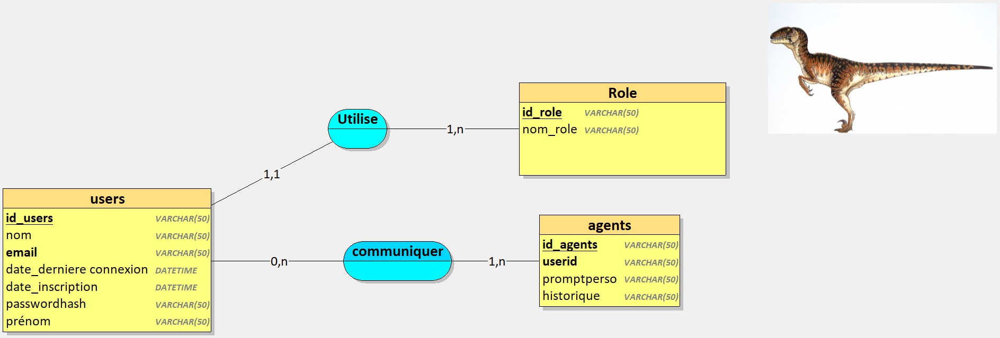
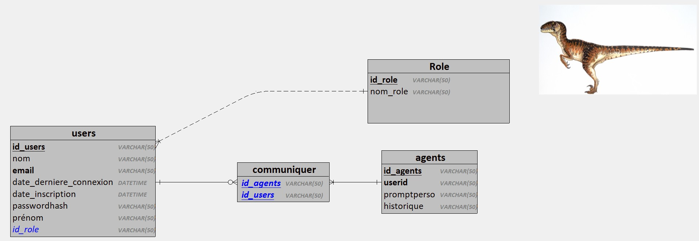

# BeautifuLLL-App

-----

# Projet : Système de Gestion d'Utilisateurs et d'Agents IA Éducatifs 🧑‍💻🤖

## Introduction (Phase 1)

Ce projet représente la première phase de conception et d'implémentation d'une application éducative utilisant des agents IA personnalisés. Cette phase se concentre sur la mise en place d'une **base de données relationnelle (MySQL)** robuste, gérant les profils utilisateurs (étudiants) et les configurations des agents IA, en utilisant la **méthode Merise** (MCD, MLD, MPD) et le respect du **RGPD**.

L'application est développée en **PHP Orienté Objet (POO)** et suit l'architecture **MVC (Modèle-Vue-Contrôleur)** manuelle, assurant une structure propre et maintenable.

L'objectif principal de cette phase est de préparer l'infrastructure de données et le socle applicatif pour l'intégration future d'un **Large Language Model (LLM)** externe (via API) ou local (ex: Ollama) en Phase 2.

## 🛠️ Stack Technique

  * **Méthode de Conception :** Merise
  * **Base de Données :** MySQL
  * **Langage Backend :** PHP (POO)
  * **Architecture :** MVC Manuel
  * **Versionnement :** Git / GitHub
  * **Conformité :** RGPD

## 🗺️ Modélisation des Données (Merise)

La conception de la base de données a suivi la méthode Merise, aboutissant aux diagrammes suivants :

### 1\. Modèle Conceptuel de Données (MCD)

Le MCD représente l'organisation des données de manière abstraite et indépendante de toute contrainte technique, se concentrant sur les entités (tables) et les relations.

**Visualisation du MCD :**

-----

### 2\. Modèle Logique de Données (MLD)

Le MLD traduit le MCD en une structure de tables avec clés primaires et étrangères, prête à être implémentée dans un SGBDR relationnel (MySQL).

**Visualisation du MLD :**


-----

### 3\. Modèle Physique de Données (MPD) / Script SQL

Le MPD est la traduction concrète du MLD en un script SQL spécifique au SGBDR choisi (MySQL).

Le script ci-dessous génère la structure complète de la base de données, y compris les tables, les clés primaires, les clés étrangères et les contraintes d'unicité.

**Script de Création de Base de Données (MPD - MySQL) :**

```sql
CREATE TABLE Role(
   id_role VARCHAR(50),
   nom_role VARCHAR(50) NOT NULL,
   PRIMARY KEY(id_role)
);

CREATE TABLE matieres(
   id_matieres VARCHAR(50),
   nom_matieres VARCHAR(50) NOT NULL,
   description_matiere VARCHAR(50),
   PRIMARY KEY(id_matieres)
);

CREATE TABLE niveau(
   id_niveau VARCHAR(50),
   libellé_niveau VARCHAR(50),
   PRIMARY KEY(id_niveau)
);

CREATE TABLE etudiants(
   id_users VARCHAR(50),
   nom VARCHAR(50) NOT NULL,
   prénom VARCHAR(50) NOT NULL,
   email VARCHAR(50) NOT NULL,
   avatar VARCHAR(50),
   passwordhash VARCHAR(50) NOT NULL,
   date_inscription DATETIME NOT NULL,
   consentement_rgpd DATETIME NOT NULL, -- Champ obligatoire pour la conformité RGPD
   id_niveau VARCHAR(50) NOT NULL,
   id_role VARCHAR(50) NOT NULL,
   PRIMARY KEY(id_users),
   UNIQUE(email),
   FOREIGN KEY(id_niveau) REFERENCES niveau(id_niveau),
   FOREIGN KEY(id_role) REFERENCES Role(id_role)
);

CREATE TABLE agent(
   id_agents VARCHAR(50),
   nom_agent VARCHAR(50) NOT NULL,
   type_agent VARCHAR(50) NOT NULL,
   avatar_agent DATETIME,
   est_actif BOOLEAN,
   description VARCHAR(50),
   date_creation DATETIME,
   prompt_systeme VARCHAR(50),
   id_matieres VARCHAR(50),
   id_users VARCHAR(50) NOT NULL, -- L'agent est rattaché à son créateur/propriétaire
   PRIMARY KEY(id_agents),
   UNIQUE(nom_agent),
   FOREIGN KEY(id_matieres) REFERENCES matieres(id_matieres),
   FOREIGN KEY(id_users) REFERENCES etudiants(id_users)
);

CREATE TABLE SESSION_CONVERSATION(
   id_session VARCHAR(50),
   date_heure_debut DATETIME NOT NULL,
   duree_session TIME NOT NULL,
   date_heure_fin DATETIME NOT NULL,
   id_agents VARCHAR(50) NOT NULL,
   id_users VARCHAR(50) NOT NULL,
   PRIMARY KEY(id_session),
   FOREIGN KEY(id_agents) REFERENCES agent(id_agents),
   FOREIGN KEY(id_users) REFERENCES etudiants(id_users)
);

CREATE TABLE message(
   id_message VARCHAR(50),
   contenu_message VARCHAR(50) NOT NULL,
   date_heure_message DATETIME NOT NULL,
   emetteur VARCHAR(50) NOT NULL, -- 'user' ou 'agent'
   id_session VARCHAR(50) NOT NULL,
   PRIMARY KEY(id_message),
   FOREIGN KEY(id_session) REFERENCES SESSION_CONVERSATION(id_session)
);
```

## 🔐 Conformité RGPD

Le champ **`consentement_rgpd`** dans la table `etudiants` garantit que l'application enregistre la date et l'heure à laquelle l'utilisateur a donné son consentement explicite pour le traitement de ses données, conformément aux exigences du Règlement Général sur la Protection des Données. La colonne `passwordhash` assure que les mots de passe sont stockés sous forme hachée.

## 🚀 Prochaine Étape (Phase 2)

La Phase 2 consistera à :

1.  Finaliser la logique métier en PHP (Modèles et Contrôleurs).
2.  Implémenter le service d'accès à l'API LLM (ex: OpenAI, Cohere) ou à une instance LLM locale (ex: Ollama).
3.  Utiliser les profils d'agents (table `agent` et champ `prompt_systeme`) pour personnaliser les interactions avec le LLM.
4.  Développer les vues (interface utilisateur) pour permettre la conversation avec les agents.